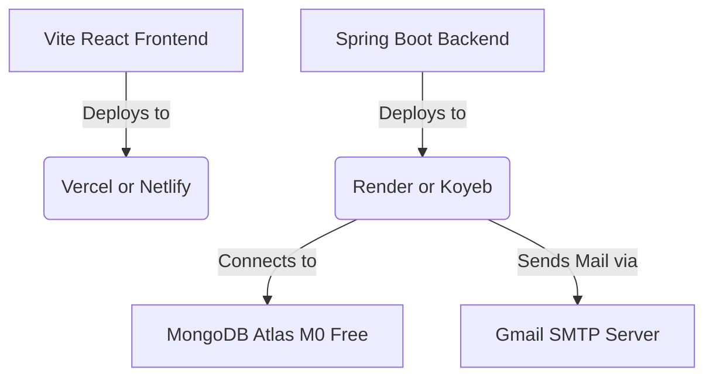

# GyanYatra Production Deployment & Configuration Guide

This guide details the steps to deploy GyanYatra on free-tier cloud platforms. The application has been refactored to be lightweight, self-contained, and highly secure.

---

## 1. Architecture Overview

GyanYatra is split into decoupled, independent components, enabling each to be hosted for free on specialized platforms:



*   **Frontend:** Hosted on Vercel or Netlify (CDN-backed, HTTPS enabled, free static hosting).
*   **Backend:** Hosted on Render or Koyeb (container/Java hosting).
*   **Database:** MongoDB Atlas (512MB free M0 cluster).
*   **Async Processing (Native):** Refactored to native Spring `@Async`. No external message broker (RabbitMQ/CloudAMQP) is needed, keeping the memory footprint under 512MB.
*   **OTP Security:** Automated via Gmail SMTP using Secure App Passwords.

---

## 2. Step-by-Step Deployment Instructions

### Step 2.1: Cloud Database (MongoDB Atlas)

1. Sign up or log in at [mongodb.com/cloud/atlas](https://www.mongodb.com/cloud/atlas).
2. Create or select a permanent free **M0 Sandbox cluster** in your preferred region (e.g. AWS / N. Virginia `us-east-1` or Mumbai `ap-south-1`).
3. Under **Network Access**, add IP address `0.0.0.0/0` to allow incoming traffic from your hosted backend server.
4. Under **Database Access**, create a user named `gyanyatramail_db_user` with password `kYVN89pQfDEYiBxi`.
5. Your production connection string is:
   ```connection-string
   mongodb+srv://gyanyatramail_db_user:<db_password>@cluster0.euxccjk.mongodb.net/gyanyatra?retryWrites=true&w=majority&appName=Cluster0
   ```

---

### Step 2.2: Backend API (Render / Koyeb / Docker)

Since the backend is built using **Java 25**, standard buildpacks may not support it out-of-the-box. We recommend utilizing the pre-configured **Dockerfile** located in the `backend/` directory for containerized deployment.

#### Method A: Docker Deployment (Recommended)
1. Push your code repository to GitHub.
2. Sign up at [render.com](https://render.com) or [koyeb.com](https://koyeb.com).
3. Create a new **Web Service** and link your GitHub repository.
4. Choose **Docker** as the deployment builder.
5. Set the **Docker Build Context** to `backend` and **Dockerfile Path** to `backend/Dockerfile` (or use the root `backend/` folder as your project root).
6. Set the **Environment Variables** in your service dashboard (see below).

#### Method B: Native Java Buildpack
1. Point the builder to the `backend/` folder.
2. Set the build command: `mvn clean package -DskipTests`
3. Set the start/run command: `java -jar gyanyatra_api/target/gyanyatra_api-1.0.0.jar`
4. Set the **Environment Variables** in your service dashboard (see below).

#### Required Backend Environment Variables:

| Variable | Recommended / Actual Value | Description |
| :--- | :--- | :--- |
| `SPRING_DATA_MONGODB_URI` | `mongodb+srv://gyanyatramail_db_user:<db_password>@cluster0.euxccjk.mongodb.net/gyanyatra?retryWrites=true&w=majority&appName=Cluster0` | Production Database connection string |
| `GOOGLE_GEMINI_API_KEY` | *(Your Gemini API Key)* | AI Reflection/Meditation Insights Engine |
| `YOUTUBE_API_KEY` | *(Your YouTube Data API v3 Key)* | Optional key to fetch real video metadata from YouTube |
| `BREVO_API_KEY` | *(Your Brevo API Key)* | Required for cloud email notifications (replaces SMTP) |

| `BREVO_SENDER_EMAIL` | `gyanyatra.mail@gmail.com` | Verified Brevo sender email address |
| `SMTP_USERNAME` | `gyanyatra.mail@gmail.com` | Local Fallback SMTP Email (optional) |
| `SMTP_PASSWORD` | *(Your Gmail App Password)* | Local Fallback SMTP Password (optional) |
| `GYANYATRA_JWT_SECRET` | *(Any long secure random string)* | Secret for signing JWT tokens |
| `GYANYATRA_ALLOWED_ORIGINS` | `https://gyan-yatra-seven.vercel.app` (comma separated list of frontend URLs) | Allowed CORS origins for production |
| `JAVA_OPTS` | `-XX:MaxRAMPercentage=75.0 -XX:ActiveProcessorCount=1` | Limits memory usage to prevent Out-Of-Memory crashes on 512MB free tier |


---

### Step 2.3: Frontend UI (Vercel)

1. Push your code repository to GitHub.
2. Sign up at [vercel.com](https://vercel.com) and link your repository.
3. Choose the `frontend` folder as the root directory of the Vercel project.
4. Configure the Build settings:
   * **Framework Preset:** `Vite`
   * **Build Command:** `npm run build`
   * **Output Directory:** `dist`
5. Configure the following environment variable in the Vercel dashboard:
   * `VITE_API_BASE` = *(The HTTPS URL of your deployed Render/Koyeb backend service, e.g., `https://gyanyatra-api.onrender.com/api/v1`)*
6. Click **Deploy**. Vercel will build your static files and serve them over a secure HTTPS domain (e.g., `https://gyanyatra.vercel.app`).

---

## 3. Local Development Setup (.env)

For local development and testing, configurations are loaded via the `.env` file inside `backend/gyanyatra_api/.env`:

```properties
GOOGLE_GEMINI_API_KEY=your_gemini_api_key_here
YOUTUBE_API_KEY=your_youtube_api_key_here
BREVO_API_KEY=your_brevo_api_key_here

BREVO_SENDER_EMAIL=gyanyatra.mail@gmail.com
SMTP_USERNAME=gyanyatra.mail@gmail.com
SMTP_PASSWORD=your_gmail_app_password_here
SPRING_DATA_MONGODB_URI=mongodb+srv://gyanyatramail_db_user:<db_password>@cluster0.euxccjk.mongodb.net/gyanyatra?retryWrites=true&w=majority&appName=Cluster0
GYANYATRA_JWT_SECRET=superSecretKeyForGyanYatraSecurityJWTEncoding2026
```

### Running Locally:
1. **Backend**: Navigate to `backend/` and run `mvn spring-boot:run -pl gyanyatra_api` (Java 25 required).
2. **Frontend**: Navigate to `frontend/` and run `npm run dev` (Vite dev server).

---

## 4. Production Security & Optimization Checklist

- [x] **Secure Database Connection**: Database requests are sent using fully encrypted TLS/SSL replica sets on MongoDB Atlas.
- [x] **Lightweight Footprint**: Removed AMQP/RabbitMQ dependencies to operate cleanly on 512MB RAM free instances.
- [x] **JWT Authorization**: Requests to private endpoints are filtered, requiring valid JWT signatures in headers.
- [x] **OTP Confidentiality**: OTP tokens are excluded from API response JSON payloads (only sent to user emails).
- [x] **Cross-Origin Resource Sharing (CORS)**: Backend CORS filters are set up to only trust specific frontend domains in production.
- [x] **JVM Memory Caps**: Embedded `-XX:MaxRAMPercentage=75.0` options prevent JVM from hogging memory and triggering OS container shutdowns.
