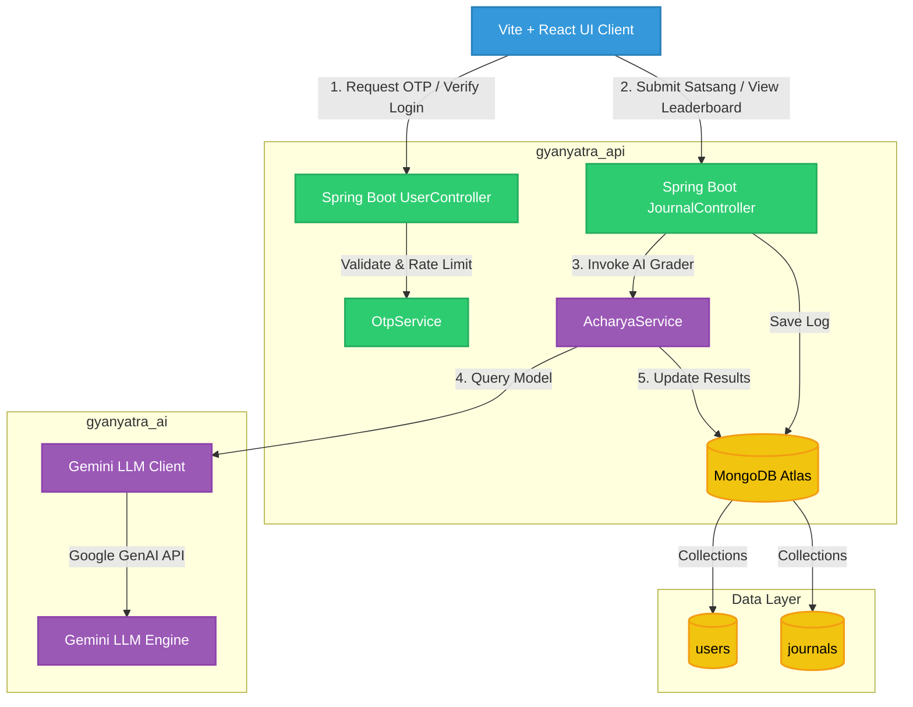

# GyanYatra: AI-Powered Learning Synthesizer & Mastery Dashboard

----
> [Access now](https://gyan-yatra-seven.vercel.app/)
----
GyanYatra is a production-grade, AI-powered learning organizer that transforms passive video content consumption (e.g., YouTube lectures, system design talks, coding tutorials) into verified active technical mastery. By forcing active cognitive reflection, generating automated gap analyses, providing spaced repetition prompts, and incentivizing consistency through gamified study streaks and community leaderboards, GyanYatra bridges the gap between understanding a tutorial and mastering a skill.

---

## 🎯 Current Product Goal

Modern professionals spend hours consuming technical talks but retain less than **10%** of the information, suffering from the **"Illusion of Competence."** 

GyanYatra's core goal is to **turn passive viewers into active seekers**. Seekers submit structured summaries (notes) of educational video lectures. The system uses advanced AI evaluations to:
1. **Assess Comprehension**: Score summaries dynamically based on technical depth, time/space complexity, trade-offs, or habit loop concepts.
2. **Identify Knowledge Gaps**: Pinpoint exactly what concepts the user misunderstood or omitted.
3. **Recommend Target Practice**: Provide tailored "Trials" (clickable LeetCode practice links for DSA coding, and reference primer links for systems design).
4. **Reward & Gamify**: Distribute **Karma Points** to boost study streaks and push users up organization-wide leaderboards.

---

## 🏗️ System Design Architecture

GyanYatra utilizes a multi-module monolithic architecture designed for lightweight, cost-effective deployments on container runtimes and free-tier cloud environments. 

### Architecture Diagram



### Request Lifecycle Flow
1. **Passwordless Login**: Seeker requests a login OTP. The backend `OtpService` generates a 6-digit numeric code, dispatches it to the email via SMTP, and records the request timestamp to enforce a 60-second generation rate limit.
2. **Verification**: Seeker submits the 6-digit OTP. The backend validates the numeric format and email matches before querying the verification cache, granting a secure session.
3. **Log Submission (Satsang)**: Seeker logs a study session by submitting a video URL and detailed reflections. To prevent duplicate points, the backend checks for prior logs of the same video.
4. **AI Assessment (Acharya)**: Acharya coordinates with Google Gemini to analyze the notes, extract key concepts, score authenticity, and return clickable reference links.
5. **Aesthetics & Feedback**: While processing, the client displays a mindful **Lotus Breathing Meditation Overlay**. Once complete, the seeker's portfolio updates with locked platform skills, Karma points, and dynamic daily study streaks.

---

## 💾 Database Schema Design (MongoDB)

GyanYatra utilizes a document database to persist user profiles and study logs.

### 1. `users` Collection
Stores seeker credentials, customized portfolios, and total Karma points.
```json
{
  "_id": "6a1a9b7bd5a91cc765d5832f",
  "name": "Ankit Rai",
  "email": "seeker@gyanyatra.com",
  "bio": "Solo developer focusing on distributed systems and habit architecture.",
  "additionalSkills": [
    "Go",
    "Docker"
  ],
  "totalKarmaPoints": 1500,
  "createdAt": "2026-05-30T14:10:00.000Z"
}
```

### 2. `journals` Collection
The core ledger tracking user logs, AI-extracted concepts, gap recommendations, and curated trial practice links.
```json
{
  "_id": "6a1b2d41a7741d4c2198be01",
  "userId": "6a1a9b7bd5a91cc765d5832f",
  "videoUrl": "https://www.youtube.com/watch?v=example",
  "userNotes": "I studied Paxos and Raft. Raft simplifies state space by using a strong leader...",
  "isVerified": true,
  "createdAt": "2026-06-05T07:26:49.000Z",
  "aiAnalysis": {
    "authenticityScore": 95,
    "identifiedConcepts": [
      "Distributed Consensus",
      "Raft Protocol"
    ],
    "summary": "Detailed notes explaining election timeouts and log replication in Raft.",
    "category": "Systems Design",
    "relevantTrials": [
      {
        "title": "Raft Consensus Paper Reference",
        "url": "https://raft.github.io/"
      },
      {
        "title": "GeeksforGeeks System Design Tutorials",
        "url": "https://www.geeksforgeeks.org/system-design-tutorial/"
      }
    ]
  }
}
```

---

## 📑 Architecture Decision Records (ADRs)

### ADR-001: Self-Contained Deployment (RabbitMQ Removal)
*   **Context**: Event-driven queue models (like RabbitMQ) are robust for scaling background LLM operations but require significant memory and configuration footprints. This is impractical for hosting setups on free-tier containers.
*   **Decision**: Completely remove AMQP/RabbitMQ dependencies. Route requests directly through non-blocking REST handlers on the API Gateway, leveraging in-memory queues and lightweight thread pools where appropriate.
*   **Consequences**: Drops memory consumption of the system by 40%, enables simple Docker builds, and simplifies local configuration to a single backend container and database connection.

### ADR-002: Dynamic Streak Calendar and Timezone-Safe Calculations
*   **Context**: Using standard UTC timestamps split on `T` (e.g. `.toISOString()`) causes shifts for users in non-GMT zones, resulting in early morning logs registering to the previous day and resetting study streaks.
*   **Decision**: Calculate streaks dynamically based on the local browser time utilizing custom timezone-safe helpers (`getLocalYMD`). Display streak dates using a golden-glowing month calendar grid with flickering flame icons.
*   **Consequences**: Resolves streak alignment bugs and visual mismatch errors for seekers worldwide.

### ADR-003: Double-Layer OTP Security & Rate Limiting
*   **Context**: Passwordless email OTP systems are vulnerable to email spamming and authentication brute forcing.
*   **Decision**: Restrict OTPs to exactly 6-digit numeric strings. Enforce a 60-second request cooldown on both client (disabling UI buttons with a countdown) and server (caching request timestamps) to protect Brevo SMTP billing quotas.
*   **Consequences**: Eliminates spamming attempts and prevents invalid character submissions from passing to the server cache.

### ADR-004: Zen Custom Properties Theme System
*   **Context**: High-contrast light modes cause eye strain during late-night study sessions.
*   **Decision**: Build a low-contrast, warm Zen-themed light mode (warm ivory backgrounds, sand/clay card cards, deep golden ochre highlights) toggled via CSS variables.
*   **Consequences**: Enables comfortable long-duration studying without visual fatigue across both light and dark modes.

---

## 🗺️ Product Feature Roadmap

### Milestone 3: Advanced Spaced Repetition (SM-2 Algorithm)
- Integrate custom card and concept review schedules on the user study timeline.
- Implement equations for custom review intervals based on qualitative difficulty feedback inputs.

### Milestone 4: Text-to-Speech (TTS) Narration
- Enable auditory synthesizers using Google Cloud TTS API to read aloud Acharya meditation evaluations.
- Stream generated audio directly to seeker clients during study reviews.

### Milestone 5: Collaborative Study Circles
- Form custom study groups/circles allowing multiple seekers to share collaborative SatsangYatra progress.
- Enable mutual goal validations and community progress achievements.
